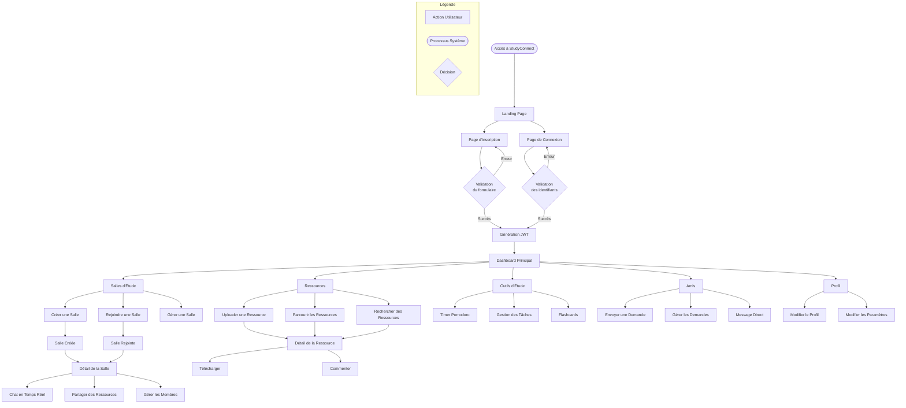

```mermaid
flowchart TD
    Start([Accès à StudyConnect]) --> Landing[Landing Page]
    Landing --> Register[Page d'Inscription]
    Landing --> Login[Page de Connexion]
    
    Register --> FormValidation{Validation\ndu formulaire}
    FormValidation -->|Succès| TokenGeneration[Génération JWT]
    FormValidation -->|Erreur| Register
    
    Login --> AuthValidation{Validation\ndes identifiants}
    AuthValidation -->|Succès| TokenGeneration
    AuthValidation -->|Erreur| Login
    
    TokenGeneration --> Dashboard[Dashboard Principal]
    
    Dashboard --> StudyRooms[Salles d'Étude]
    Dashboard --> Resources[Ressources]
    Dashboard --> Friends[Amis]
    Dashboard --> Profile[Profil]
    Dashboard --> StudyTools[Outils d'Étude]
    
    StudyRooms --> CreateRoom[Créer une Salle]
    StudyRooms --> JoinRoom[Rejoindre une Salle]
    StudyRooms --> ManageRoom[Gérer une Salle]
    
    CreateRoom --> RoomCreated[Salle Créée]
    JoinRoom --> RoomJoined[Salle Rejointe]
    
    RoomCreated --> RoomDetail[Détail de la Salle]
    RoomJoined --> RoomDetail
    
    RoomDetail --> Chat[Chat en Temps Réel]
    RoomDetail --> ShareResources[Partager des Ressources]
    RoomDetail --> ManageMembers[Gérer les Membres]
    
    Resources --> UploadResource[Uploader une Ressource]
    Resources --> BrowseResources[Parcourir les Ressources]
    Resources --> SearchResources[Rechercher des Ressources]
    
    UploadResource --> ResourceDetail[Détail de la Ressource]
    BrowseResources --> ResourceDetail
    SearchResources --> ResourceDetail
    
    ResourceDetail --> DownloadResource[Télécharger]
    ResourceDetail --> CommentResource[Commenter]
    
    StudyTools --> Timer[Timer Pomodoro]
    StudyTools --> Tasks[Gestion des Tâches]
    StudyTools --> Flashcards[Flashcards]
    
    Friends --> SendRequest[Envoyer une Demande]
    Friends --> ManageRequests[Gérer les Demandes]
    Friends --> DirectMessage[Message Direct]
    
    Profile --> EditProfile[Modifier le Profil]
    Profile --> ChangeSettings[Modifier les Paramètres]
    
    subgraph "Légende"
        UserAction[Action Utilisateur]
        SystemProcess([Processus Système])
        Decision{Décision}
    end
``` 