# StudyConnect Database Tables for Excalidraw

## User Table

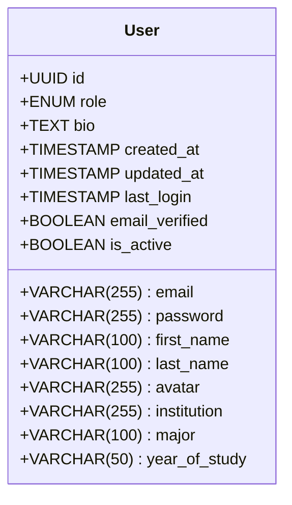

## User Preferences Table

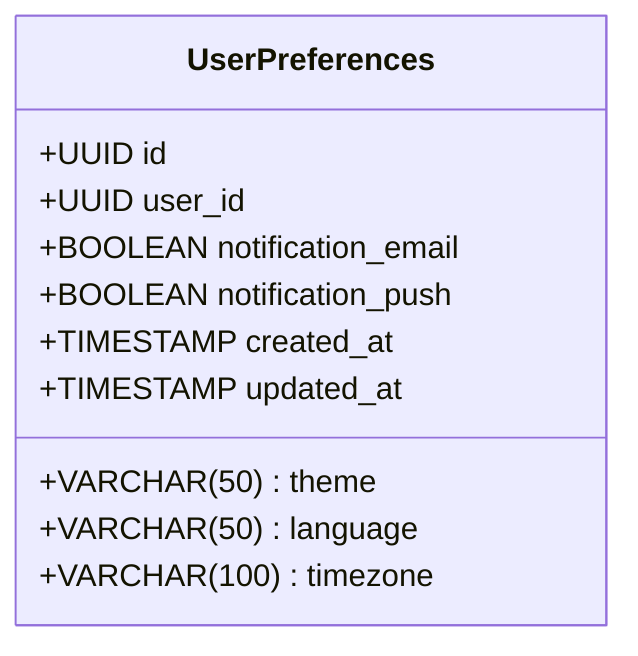

## User Subjects Table

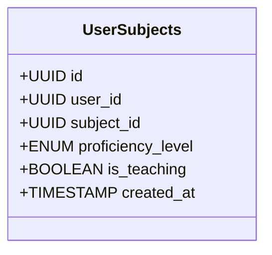

## Subject Table

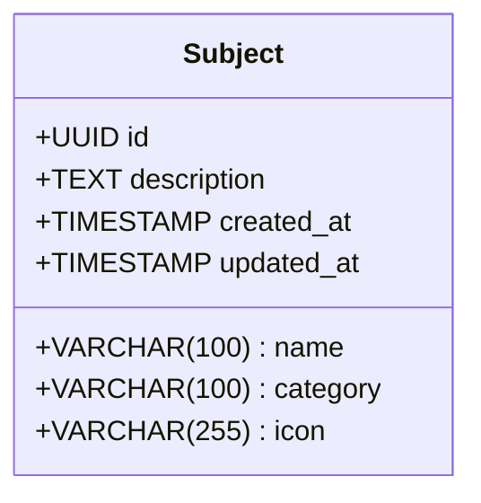

## Study Room Table

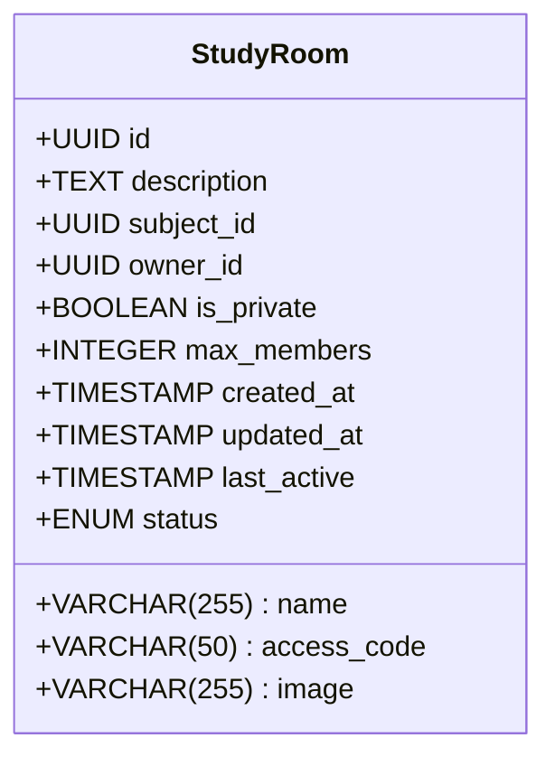

## Study Room Member Table

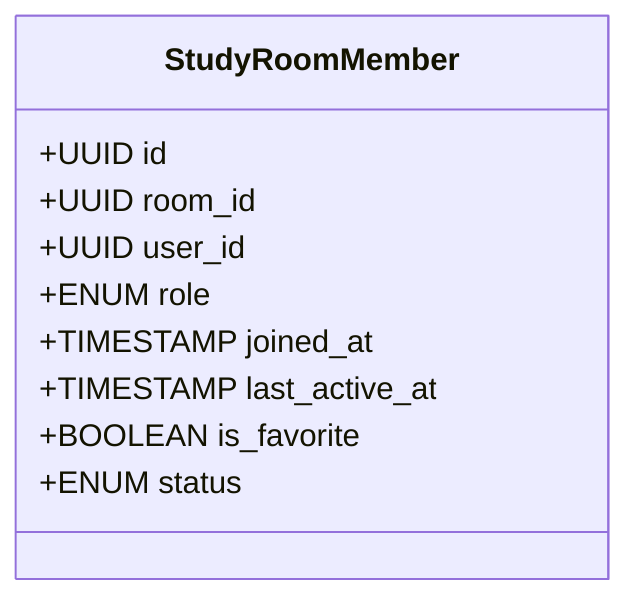

## Study Room Request Table

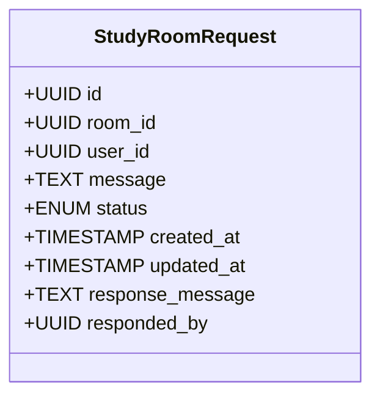

## Message Table

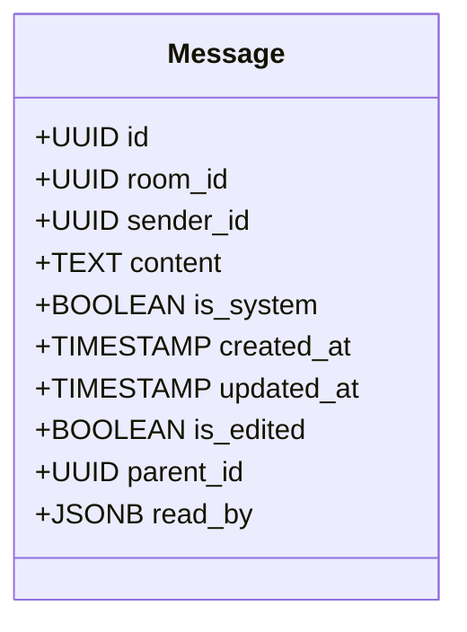

## Resource Table

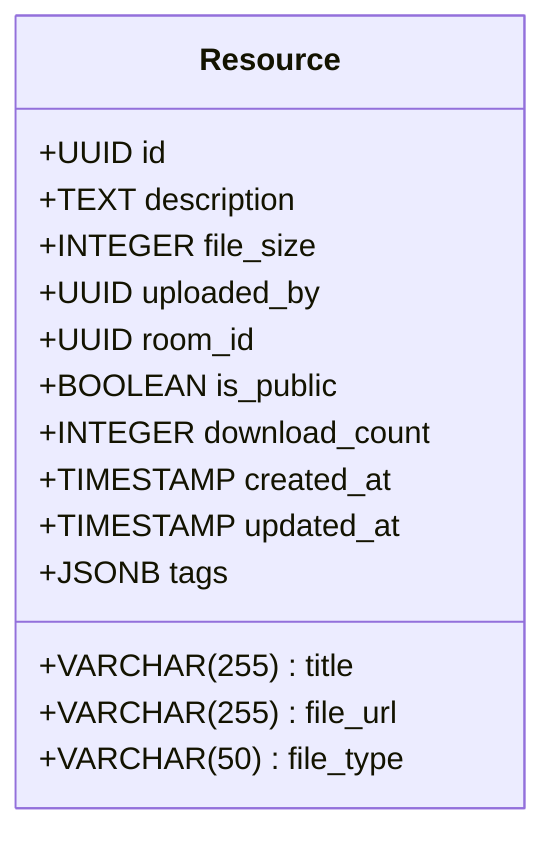

## Event Table

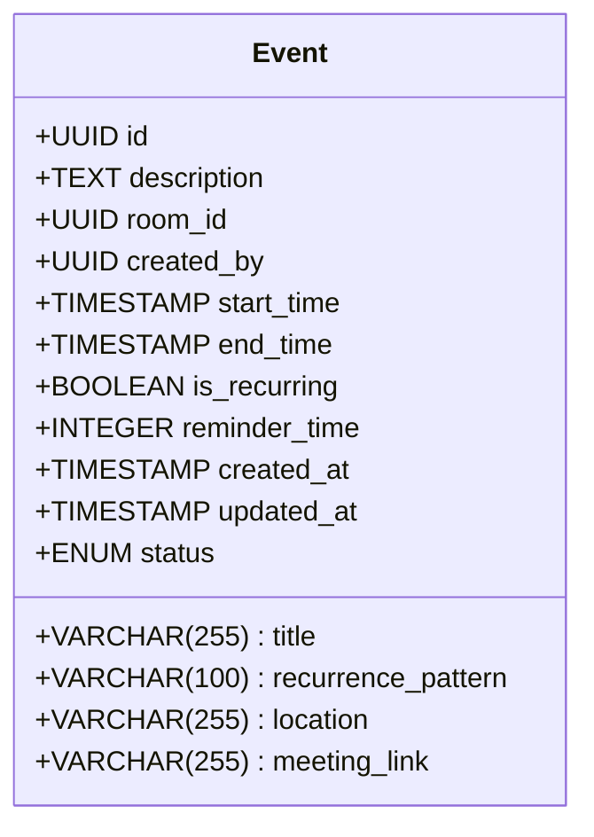

## Event Attendee Table

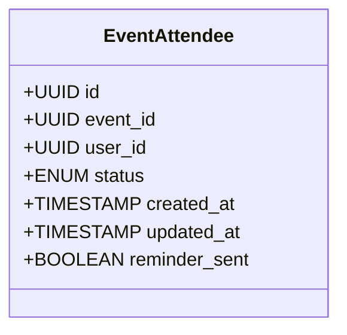

## Flashcard Deck Table

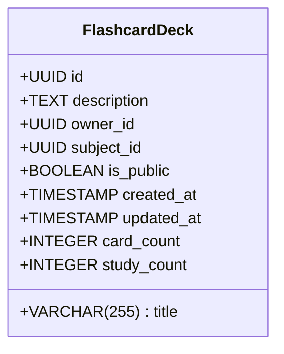

## Flashcard Table

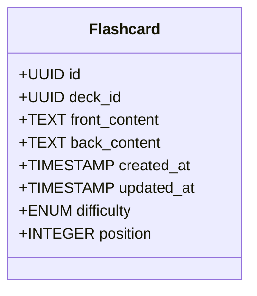

## Study Session Table

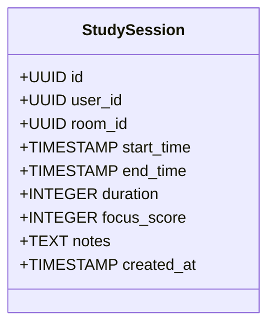

## Notification Table

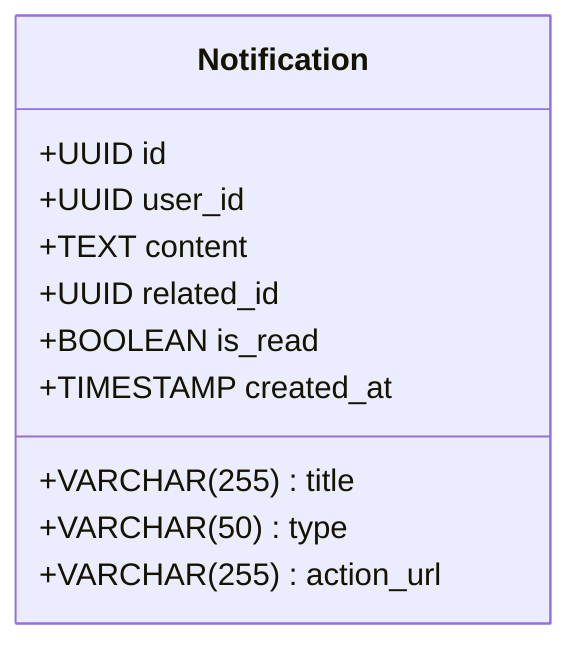