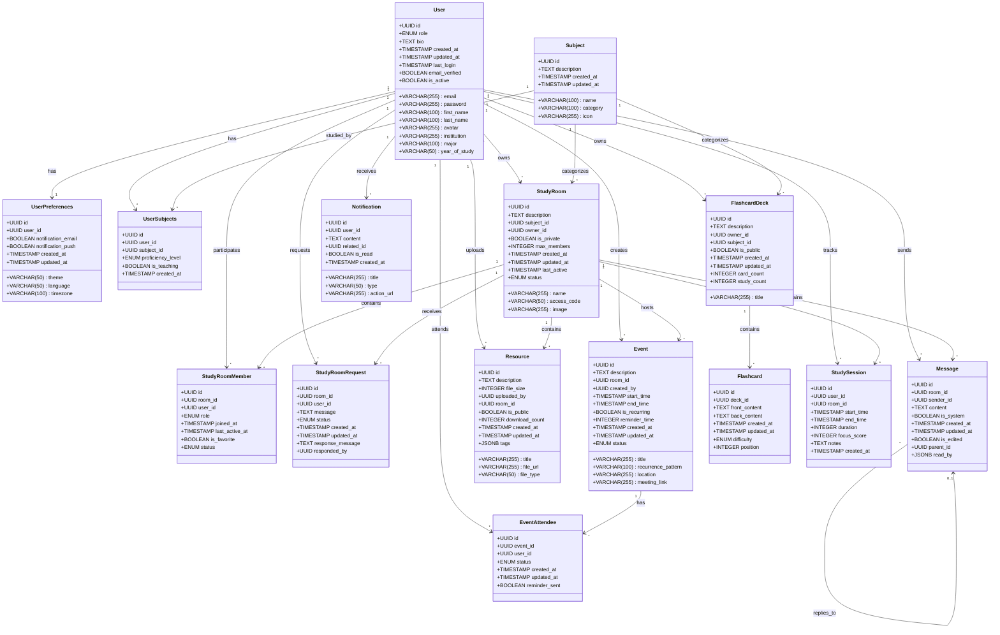
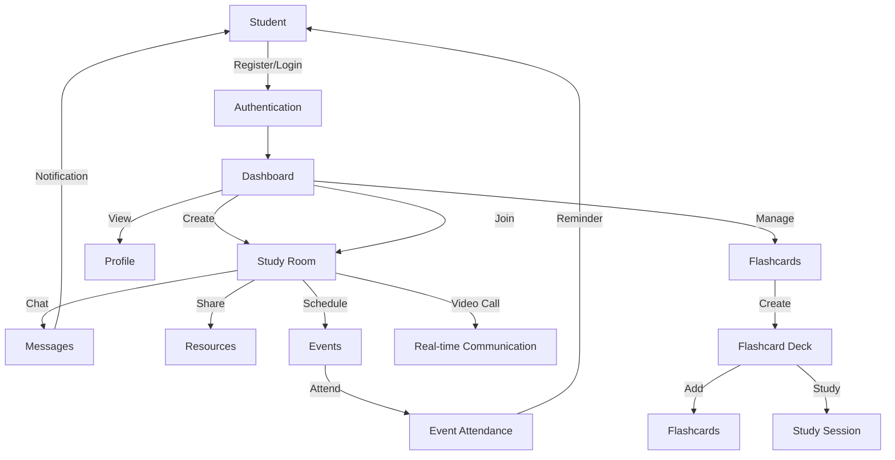
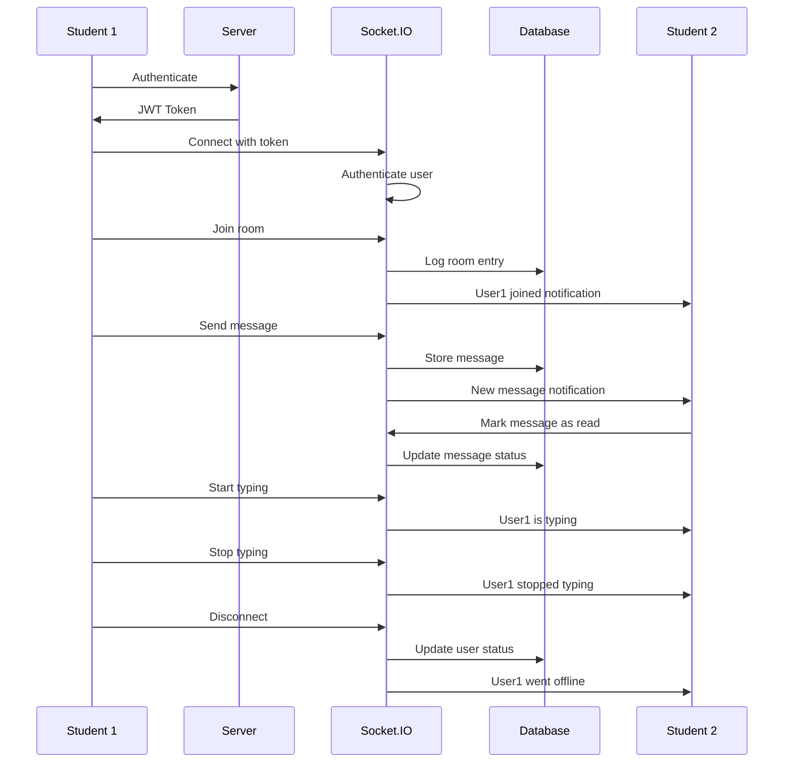
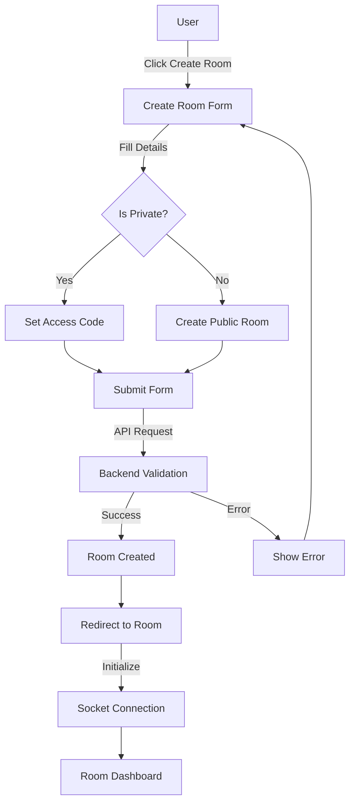
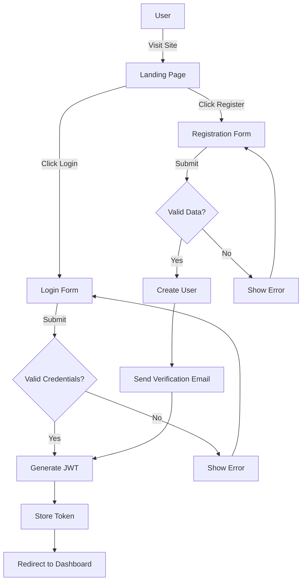

# StudyConnect - Project Documentation

## Table of Contents
- [Project Overview](#project-overview)
- [Database Schema](#database-schema)
- [System Architecture](#system-architecture)
- [User Flows](#user-flows)
- [Implementation Plan](#implementation-plan)
- [Technical Specifications](#technical-specifications)
- [Timeline](#timeline)
- [Tools & Resources](#tools--resources)

## Project Overview

StudyConnect is a web platform designed to facilitate student interactions, collaborative learning, and resource sharing. The platform enables students to create and join study rooms, share resources, communicate in real-time, schedule events, and organize study materials.

### Key Features
- User authentication and profile management
- Study room creation and management
- Real-time messaging
- Resource sharing and organization
- Event scheduling and attendance tracking
- Flashcard creation and study tools
- Study session tracking

### Target Users
- University students
- High school students
- Study groups
- Educational institutions
- Self-learners

## Database Schema

### Class Diagram


### Individual Tables

For detailed information on each table's structure, see [Individual Tables Documentation](excalidraw_individual_tables.md).

## System Architecture

### User Flow Diagram


### Real-time Messaging Sequence


### Study Room Creation Flow


### Authentication Flow


## Implementation Plan

### Technology Stack
- **Frontend**: React.js, Redux, Socket.io Client, Material UI
- **Backend**: Node.js, Express.js, Socket.io
- **Database**: PostgreSQL with UUID extension
- **Authentication**: JWT-based authentication
- **File Storage**: AWS S3 or equivalent
- **Deployment**: Docker, AWS/GCP/Azure

### Project Structure

#### Backend Structure
```
/backend
  /src
    /controllers    # Request handlers
    /models         # Database models
    /routes         # API routes
    /middlewares    # Auth, validation, etc.
    /services       # Business logic
    /utils          # Helper functions
    /config         # Configuration files
    /sockets        # Socket.io handlers
    /validators     # Input validation
    app.js          # Express app setup
    server.js       # Server entry point
  /tests            # Unit and integration tests
  package.json
  .env.example
  Dockerfile
```

#### Frontend Structure
```
/frontend
  /public           # Static assets
  /src
    /components     # Reusable UI components
    /pages          # Page components
    /contexts       # React contexts (Auth, etc.)
    /hooks          # Custom React hooks
    /services       # API service calls
    /utils          # Helper functions
    /assets         # Images, styles, etc.
    /redux          # State management
    App.js          # Main component
    index.js        # Entry point
  package.json
  .env.example
  Dockerfile
```

### API Endpoints

#### Authentication
- `POST /api/auth/register` - Register new user
- `POST /api/auth/login` - Login user
- `POST /api/auth/logout` - Logout user
- `GET /api/auth/me` - Get current user
- `PUT /api/auth/me` - Update user profile

#### Users
- `GET /api/users/:id` - Get user profile
- `PUT /api/users/:id/preferences` - Update user preferences
- `GET /api/users/:id/subjects` - Get user subjects
- `POST /api/users/:id/subjects` - Add user subject

#### Study Rooms
- `GET /api/rooms` - List study rooms
- `POST /api/rooms` - Create study room
- `GET /api/rooms/:id` - Get study room details
- `PUT /api/rooms/:id` - Update study room
- `DELETE /api/rooms/:id` - Delete study room
- `POST /api/rooms/:id/join` - Join study room
- `POST /api/rooms/:id/leave` - Leave study room

#### Messages
- `GET /api/rooms/:id/messages` - Get room messages
- `POST /api/rooms/:id/messages` - Send message
- `PUT /api/messages/:id` - Update message
- `DELETE /api/messages/:id` - Delete message
- `PUT /api/messages/:id/read` - Mark message as read

#### Resources
- `GET /api/rooms/:id/resources` - Get room resources
- `POST /api/rooms/:id/resources` - Upload resource
- `GET /api/resources/:id` - Get resource details
- `PUT /api/resources/:id` - Update resource
- `DELETE /api/resources/:id` - Delete resource
- `GET /api/resources/:id/download` - Download resource

#### Events
- `GET /api/rooms/:id/events` - Get room events
- `POST /api/rooms/:id/events` - Create event
- `GET /api/events/:id` - Get event details
- `PUT /api/events/:id` - Update event
- `DELETE /api/events/:id` - Delete event
- `POST /api/events/:id/attend` - Attend event

#### Flashcards
- `GET /api/decks` - List flashcard decks
- `POST /api/decks` - Create flashcard deck
- `GET /api/decks/:id` - Get deck details
- `PUT /api/decks/:id` - Update deck
- `DELETE /api/decks/:id` - Delete deck
- `GET /api/decks/:id/cards` - Get deck cards
- `POST /api/decks/:id/cards` - Create flashcard
- `PUT /api/cards/:id` - Update flashcard
- `DELETE /api/cards/:id` - Delete flashcard

### Implementation Phases

#### Phase 1: Core Features
- User authentication and profiles
- Study room creation and management
- Basic messaging functionality

#### Phase 2: Enhanced Collaboration
- Real-time messaging with Socket.io
- Resource sharing and management
- Event scheduling

#### Phase 3: Study Tools
- Flashcard system
- Study session tracking
- Advanced search and filters

#### Phase 4: Optimization & Additional Features
- Performance optimizations
- Mobile responsiveness improvements
- Notifications system
- Analytics dashboard

## Technical Specifications

### Security Considerations
- HTTPS for all communications
- JWT with short expiry and refresh tokens
- Password hashing with bcrypt
- Input validation and sanitization
- CSRF protection
- Rate limiting for API endpoints
- SQL injection prevention with prepared statements

### Scalability Considerations
- Horizontal scaling for API servers
- Database connection pooling
- Caching layer with Redis
- CDN for static assets
- Optimized database queries with proper indexing
- Pagination for large data sets

### Testing Strategy
- Unit tests for business logic
- Integration tests for API endpoints
- End-to-end tests for critical user flows
- Performance testing for high-traffic scenarios
- Security testing for vulnerabilities

## Timeline

### Month 1: Planning & Setup
- Week 1: Project requirements and planning
- Week 2: Database schema design and API specifications
- Week 3: Development environment setup
- Week 4: Authentication system implementation

### Month 2: Core Development
- Week 5-6: User profile and study room features
- Week 7-8: Messaging system and real-time communication

### Month 3: Feature Expansion
- Week 9-10: Resource sharing and event scheduling
- Week 11-12: Flashcard system and study tools

### Month 4: Refinement & Deployment
- Week 13-14: Testing, bug fixing, and optimization
- Week 15: Documentation and final touches
- Week 16: Deployment and monitoring setup

## Tools & Resources

### Development Tools
- **Code Editor**: Visual Studio Code
- **Version Control**: Git & GitHub
- **API Testing**: Postman
- **Database Management**: pgAdmin
- **Design**: Figma

### Deployment & Infrastructure
- **Containerization**: Docker & Docker Compose
- **CI/CD**: GitHub Actions
- **Cloud Provider**: AWS/GCP/Azure
- **Monitoring**: Sentry, Prometheus & Grafana

### Libraries & Frameworks
- **Frontend**: 
  - React.js for UI components
  - Redux for state management
  - Socket.io Client for real-time features
  - Material UI for design system
  - Axios for API requests
  
- **Backend**:
  - Express.js for API framework
  - Sequelize for ORM
  - Socket.io for WebSockets
  - Passport.js for authentication
  - Multer for file uploads
  - Joi for validation 